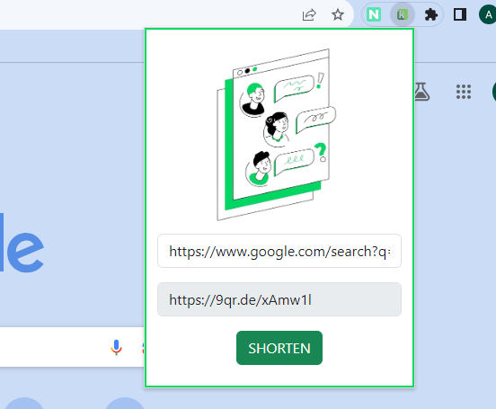

<!-- PROJECT LOGO -->
<br />
<div align="center">
  <a href="https://github.com/AksaRose/nexus">
    
  </a>

  <h3 align="center">KUNJI</h3>

  <p align="center">
    A URL shortener
    <br />
  
  </p>
</div>


<!-- ABOUT THE PROJECT -->
## About The Project



This repository contains the code and resources for our group project - a URL shortening Chrome extension. With this extension, users can easily create shortened versions of long URLs for convenience and sharing. Whether you're a developer or just interested in how this extension works, this README will guide you through the project setup and usage.


## Developers
* Vinsu Susan Thomas : https://github.com/vinsu353
* Jamie mathew : https://github.com/jamieemathew
* Aksa Rose : https://github.com/AksaRose


### Built With
* HTML
* CSS
* JAVASCRIPT


<!-- GETTING STARTED -->
## Getting Started

### Installation

 Clone this repository to your local machine:
 ```sh
   git clone https://github.com/AksaRose/nexus.git
   ```
1. Open Google Chrome.
2. Navigate to chrome://extensions/.
3. Enable "Developer mode" in the upper-right corner.
4. Click on the "Load unpacked" button.
5. Select the 'src' directory from the cloned repository.
6. The extension will now be installed and can be accessed from your Chrome toolbar.

<p align="right">(<a href="#readme-top">back to top</a>)</p>


<!-- USAGE EXAMPLES -->
## Usage

1. Click on the extension icon in the Chrome toolbar to open the extension popup.
2. Paste your long URL into the input field.
3. Click the "SHORTEN" button to generate a shortened URL.
4. Select the shortened URL, right click and copy the URL.

<p align="right">(<a href="#readme-top">back to top</a>)</p>


